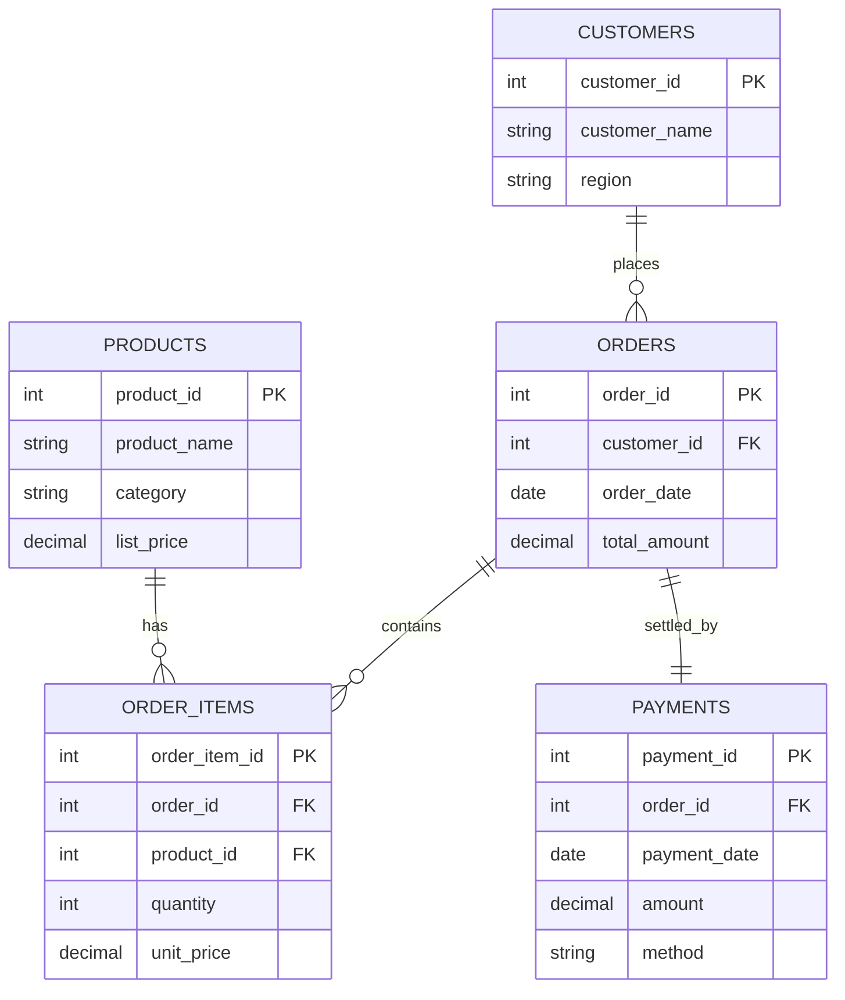

• Conducted comprehensive business analysis and created detailed reports using data analytics tools.
• Designed and implemented Entity Relationship Diagrams (ERD) for database modeling and optimization.
• Developed complex SQL queries and database solutions for data extraction and analysis.
• Created interactive data visualizations to effectively communicate insights and trends.
• Applied structured analytical approaches across multiple business scenarios with 167 documented contributions.

**Tools & Technologies**
- SQL (PostgreSQL / MySQL)
- Power BI / Tableau (visuals and reporting)
- Excel / CSV (data handling)
- Draw.io / Lucidchart (ERD)
- GitHub (version control)

**Project Contents**
- database/ — schema DDL, ERD (image), and documentation
- sql_queries/ — cleaning, KPIs, trends, LTV, cohorts, and reporting SQL
- visualizations/ — PNG charts for recruiters; add PBIX/TWBX if desired
- data/ — realistic sample CSVs (customers, orders, order_items, payments, products)
- documentation/ — business methodology, KPI definitions, insights & recommendations

**ERD (Mermaid Preview)**

**How to Use**
1) Import CSVs from `data/` into your SQL database.
2) Execute `database/create_tables.sql` to create schema and constraints.
3) Execute `database/insert_sample_data.sql` (optional) if you prefer INSERTs over CSV import.
4) Run SQL from `sql_queries/` for KPIs, trends, LTV, cohorts, and reports.
5) View charts in `visualizations/` — replace with Power BI/Tableau dashboards if available.

**Author**
Yogesh Kumar Motwani · yogesh.m@mailsworks.com · LinkedIn: https://www.linkedin.com/in/yogeshmotwani
